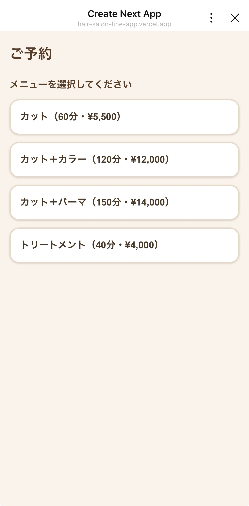
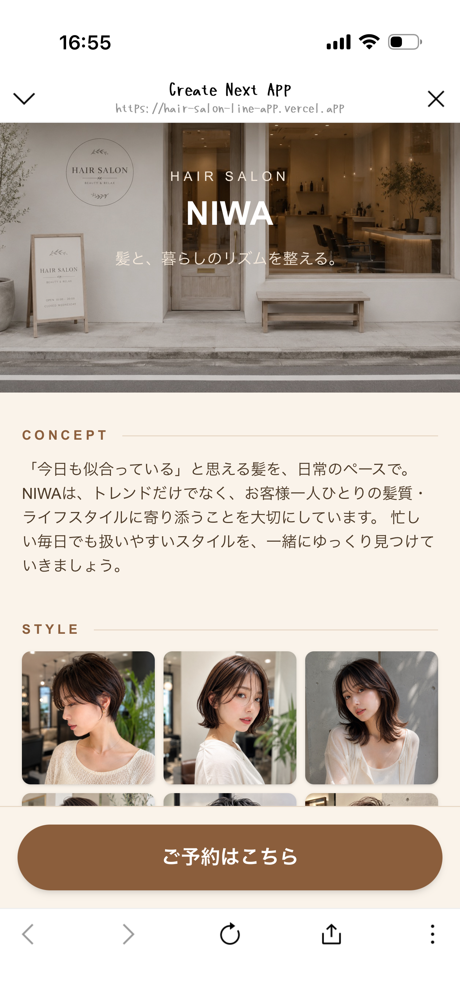
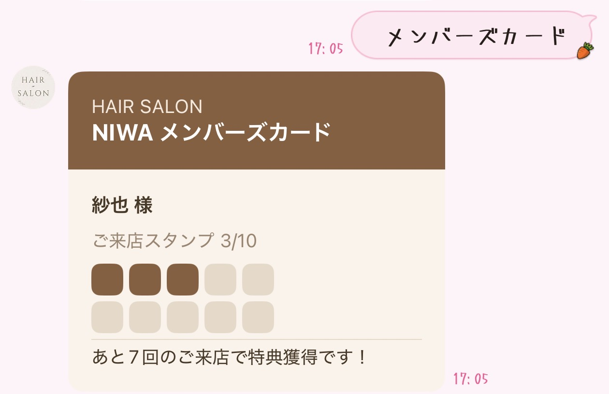
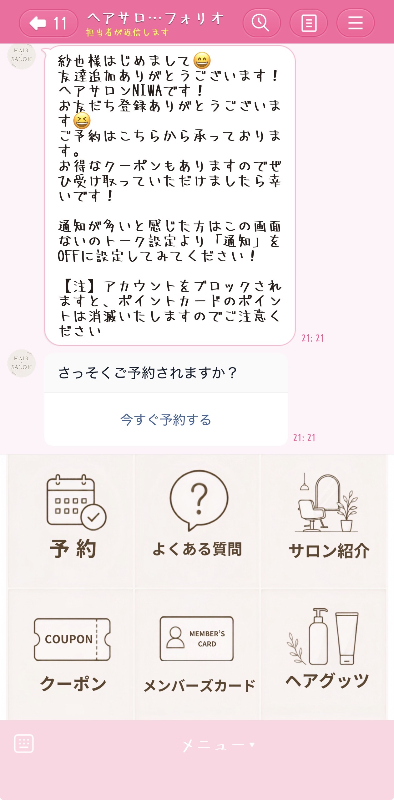

# hair-salon-line-app


ヘアサロンの公式LINEシステム。「LINEひとつでマーケティングが完結する」ことをゴールに、予約・よくある質問・事前ヒアリング・サロン紹介LIFF・商品購入・前日リマインド・ポイントカード・リッチメニュー出し分けを段階的に実装する。詳しい仕様・予算試算は [`docs/SPEC.md`](./docs/SPEC.md) を参照。

## スクリーンショット

| 予約画面 (LIFF) | サロン紹介ページ | メンバーズカード (LINE) |
|---|---|---|
|  |  |  |

友だち追加時のあいさつ〜リッチメニュー（予約／よくある質問／サロン紹介／クーポン／メンバーズカード／ヘアグッズ購入）が実際にLINE上で動作している画面：



## 技術スタック

- Next.js（App Router / TypeScript / Tailwind） on Vercel
- Prisma（Postgres, Neon想定）
- LINE Messaging API（`@line/bot-sdk`） / LIFF（`@line/liff`）
- Dify（よくある質問Bot。LLMはGoogle Gemini経由）

## 進捗（フェーズ1: 予約システムの土台） — 完了 ✅

- [x] DBスキーマ（Customer / Staff / Service / Reservation）
- [x] LINE連携ヘルパー（メッセージ送受信・署名検証・LIFFログイン検証）
- [x] 予約API（`/api/menu`, `/api/availability`, `/api/reservations`）
- [x] LIFF予約画面（`/liff/reserve`。茶色×クリームのブランドカラーでデザイン、レスポンシブ対応済み）
- [x] Webhook（友だち追加時のあいさつ＋予約ボタン）
- [x] Neon DBへの接続・マイグレーション実行（Vercel Marketplace経由でNeonを自動プロビジョニング）
- [x] LINE Developersでの資格情報取得・実機での動作確認（友だち追加→あいさつ→LIFF予約まで確認済み）
- [x] Vercel本番デプロイ（本番URL: `https://hair-salon-line-app.vercel.app`）

## 進捗（フェーズ2〜6・8: 各機能の追加） — 完了 ✅

- [x] よくある質問Bot（Dify連携）。Webhookでテキストメッセージを受信し、Dify Chat APIに問い合わせて回答（`src/lib/dify.ts`, `DifyConversation`テーブルで会話継続）
- [x] サロン紹介ページ（`/about`）。ヘッダー写真・コンセプト・スタイル写真ギャラリー（スクロールでふわっと表示されるアニメーション付き）・スタイリスト・メニュー・アクセスを掲載。写真は`public/images/about/`に置くだけで反映（未設置ならプレースホルダー表示）
- [x] 事前ヒアリング。予約LIFF（`/liff/reserve`）のご要望ステップに、よくある要望を選べるチップ（任意・複数選択）を追加
- [x] 前日リマインド。Vercel Cron（毎日18:00 JST）が翌日予約のお客様にPush Messageを自動送信（`/api/cron/reminder`, `CRON_SECRET`で保護）
- [x] メンバーズカード。来店実績に応じたスタンプ状況をFlex Message（カード風デザイン）で返信
- [x] 予約確認。「予約確認」と送ると直近の予約内容をFlex Messageで返信
- [x] ヘアグッズ購入ページ（`/shop`）。商品一覧の表示のみ実装済み（Stripe等の決済連携は未実装）。写真は`public/images/shop/`に置くだけで反映
- [x] リッチメニュー（6分割: 予約／よくある質問／サロン紹介／クーポン／メンバーズカード／ヘアグッズ購入）。クーポンはLINE公式アカウント標準のクーポン機能を利用
- [x] 友だち追加時のあいさつをDifyの「オープニングメッセージ」設定から取得。`{{name}}`と書いておくとLINEの表示名に自動置換される

## 未着手・保留

- **ヘアグッズ購入の決済（Stripe連携）**: Stripeアカウント未作成のため保留。一覧ページ（`/shop`）までは完成済み
- **リッチメニューの出し分け**: 実施しない方針に決定

詳細な仕様・各機能の設計意図は [`docs/SPEC.md`](./docs/SPEC.md) を参照。

## セットアップ

### 1. 依存パッケージのインストール

```bash
npm install
```

### 2. 環境変数の設定

`.env.example` を `.env` にコピーし、値を埋める。

```bash
cp .env.example .env
```

| 変数名 | 取得場所 |
|---|---|
| `DATABASE_URL` | [Neon](https://neon.tech) で直接作成してもよいが、`vercel link` 後に `vercel integration add neon` を実行するとVercel経由で自動プロビジョニングされ、`vercel env pull` でこのプロジェクトにも自動反映される（本プロジェクトはこの方法で構築済み） |
| `LINE_CHANNEL_ACCESS_TOKEN` | LINE Developers → Messaging APIチャネル → 「Messaging API設定」タブ → 「チャネルアクセストークン」を発行 |
| `LINE_CHANNEL_SECRET` | LINE Developers → Messaging APIチャネル → 「チャネル基本設定」タブ |
| `LINE_LOGIN_CHANNEL_ID` | LINE Developers → LINEログインチャネル（LIFF用の別チャネル）→ 「チャネル基本設定」タブの Channel ID |
| `NEXT_PUBLIC_LIFF_ID` | 上記LINEログインチャネルの「LIFF」タブでLIFFアプリを追加すると発行される |
| `DIFY_API_KEY` | Dify（よくある質問Bot用チャットフローアプリ）画面左メニュー「APIアクセス」で発行 |
| `DIFY_API_BASE_URL` | Dify Cloudの場合は既定値（`https://api.dify.ai/v1`）のままでよい |
| `CRON_SECRET` | 前日リマインドのCronエンドポイントを守る合言葉。`openssl rand -hex 24`等でランダム生成する |

LIFFアプリを追加する際の「エンドポイントURL」は、デプロイ先のURL＋`/liff/reserve`（例: `https://xxxx.vercel.app/liff/reserve`）を指定する。

### サロン紹介ページの写真設置（任意）

`public/images/about/` に以下のファイル名で置くと、`/about`ページに反映される（置かなければプレースホルダー表示のまま動作する）。

| ファイル名 | 用途 | 推奨サイズ |
|---|---|---|
| `hero.jpg` | トップの雰囲気画像 | 横長 1600×900程度 |
| `style-1.jpg` 〜 `style-6.jpg` | カット後のスタイル写真ギャラリー（あるものだけ表示） | 正方形 600×600程度 |
| `stylist-1.jpg`, `stylist-2.jpg`, ... | スタイリスト写真（表示順=Staffの`sortOrder`順） | 正方形 600×600程度 |

同様に `public/images/shop/` に `product-1.jpg`, `product-2.jpg`, ...（表示順=Productの`sortOrder`順、正方形推奨）を置くと、`/shop`ページに商品写真が反映される。

### 3. DBマイグレーション

```bash
npx prisma migrate dev --name init
npx prisma db seed
```

### 4. 開発サーバー起動

```bash
npm run dev
```

## Webhook URLの設定

LINE Developers → Messaging APIチャネル → 「Messaging API設定」タブ → Webhook URLに、デプロイ先の `/api/line/webhook` を設定し、Webhookをオンにする（本番: `https://hair-salon-line-app.vercel.app/api/line/webhook`）。

`follow`イベント（友だち追加時のあいさつ）は初回追加時にしか発火しないため、動作確認をやり直したい場合は一度LINEでブロック→ブロック解除（再追加）する。

## デプロイ

```bash
vercel --prod
```

環境変数のうちDB系（`DATABASE_URL`等）はNeon連携で自動同期されるが、LINE系4つ（`LINE_CHANNEL_ACCESS_TOKEN` / `LINE_CHANNEL_SECRET` / `LINE_LOGIN_CHANNEL_ID` / `NEXT_PUBLIC_LIFF_ID`）は`vercel env add <name> production`で別途登録する必要がある（登録後は再デプロイが必要）。

- 本番URL: https://hair-salon-line-app.vercel.app
- GitHubリポジトリ（公開）: https://github.com/niwasaya0501-cyber/hair-salon-line-app
